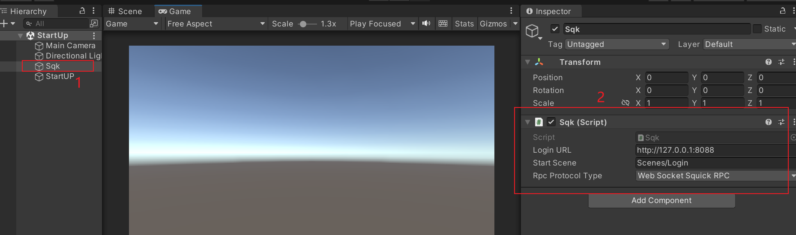
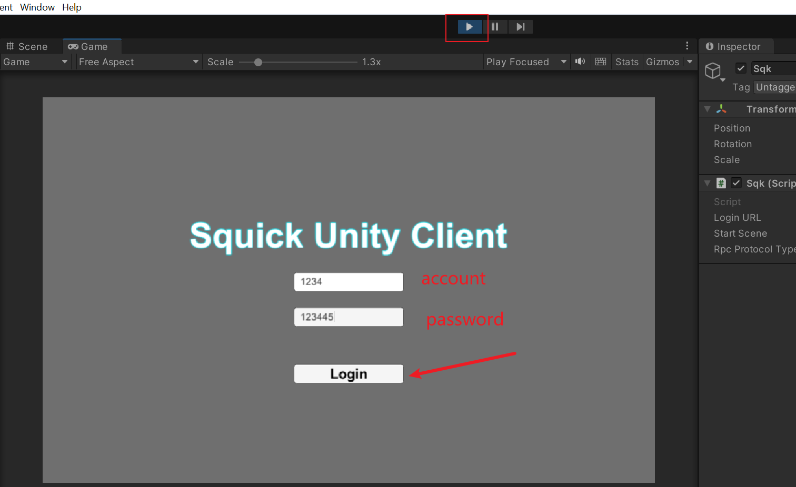
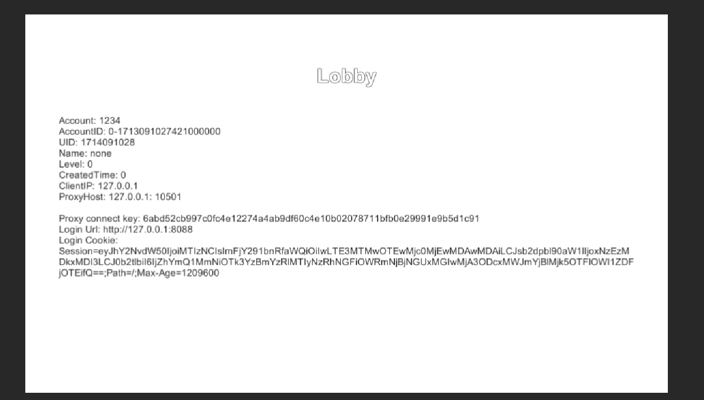
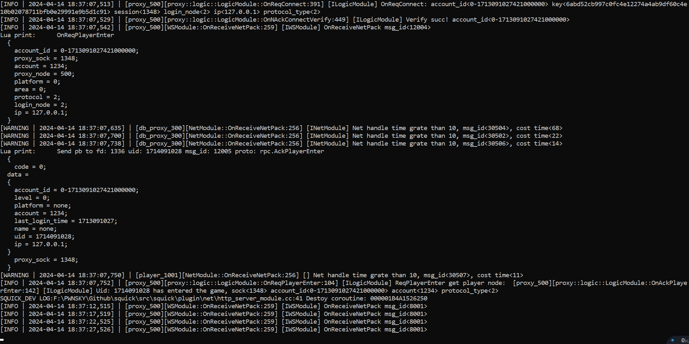

# Squick Unity SDK

## Intro

The squick Unity SDK

Unity version: 2020.03 above

version: 1.1.0

[Squick Src](https://github.com/pwnsky/squick)

## Feature

Surport TCP or Websocket connection with squick

So you can build you project to web applicaiton.

### Quick Start

Open project, make sure your **all scenes is loaded in Build Settings**

Open start up scene: **/Assets/Scenes/StartUp.unity**

In Hireachy panel select **Sqk** object. Then you can modify **Login URL** and **Rpc Protocol Type** in Inspector panel. Default info mation as follows.

Start project

Login Succ infomation.

The server login succ infomation.

That's all, Just so so!
