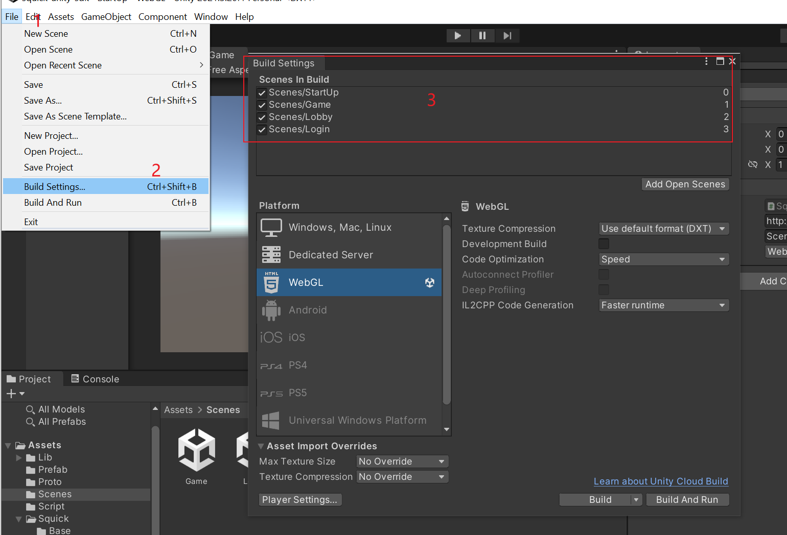

# Squick Unity SDK

## Intro

The squick Unity SDK

Unity version: 2020.03 above

version: 1.1.1

[Squick Src](https://github.com/pwnsky/squick)

## Feature

Keep it simple, Just a network library.

Surport TCP or Websocket connection with squick

So you can build you project to web applicaiton.

## Quick Start

### Step 1. Modify Login URL & Protocol type

Open project, make sure your **all scenes is loaded in Build Settings**

Open start up scene: **/Assets/Scenes/StartUp.unity**

In Hireachy panel select **Sqk** object. Then you can modify **Login URL** and **Rpc Protocol Type** in Inspector panel. Default infomation as follows.

The **Login URL** is squick login node URL.  this node default http port is 8088

The **Rpc Protocol Type** now surported **TCP Squick RPC** & **Web Socket Squick RPC**, But the **Web Socket Security Squick RPC** now squick not surpport it.

### Step 2. Start project

### Step 3. Login Succ

Login Succ infomation.

The server login succ infomation.

That's all, Just so so!
